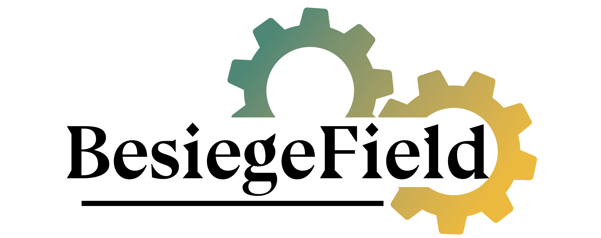

<div align="center">
  
</div>

<div align="center">

**A Framework for LLM-Driven Machine Design in Besiege**

Paper: [Agentic Design of Compositional Machines](https://arxiv.org/abs/2510.14980)

<a href="https://arxiv.org/abs/2510.14980"></a>
<a href="https://besiegefield.github.io/"></a>

[](LICENSE)
[](https://www.python.org/)
[](https://store.steampowered.com/app/346010/Besiege)
[](https://ubuntu.com/)

[Installation](#-installation) • [Quick Start](#-quick-start) • [Training](#-llm-fine-tuning) • [Citation](#-citation)

</div>

---
## 📋 Table of Contents


- [Overview](#-overview)
- [Installation](#-installation)
  - [Besiege Environment Setup](#1-besiege-environment-setup)
  - [AgenticFlow Installation](#2-agenticflow-installation)
- [Quick Start](#-quick-start)
- [Fine-tuning](#-llm-fine-tuning)
- [Citation](#-citation)

---

## 🌟 Overview

BesiegeField is a cutting-edge framework that enables Large Language Models (LLMs) to autonomously design and build complex machines in the Besiege physics-based game environment. This project bridges AI reasoning with creative engineering tasks.

---

## 🚀 Installation

### 1. Besiege Environment Setup

#### 📦 System Requirements

| Component | Version |
|-----------|---------|
| **Besiege** | Linux v1.60-22044 |
| **Ubuntu** | 22.04 |
| **GLIBC** | 2.33 – 2.35 |
| **Mono** | ≥ 6.8.0.105 |

#### 🎯 Obtain the Game

**Step 1:** Purchase the official copy on [Steam](https://store.steampowered.com/app/346010/Besiege)

**Step 2:** Download [DepotDownloader](https://github.com/SteamRE/DepotDownloader)

**Step 3:** Download Besiege v1.60-22044

```bash
./DepotDownloader -app 346010 -depot 346016 -manifest 2732248020700221971 \
  -username <steam_user> -password <password>
```

**Step 4:** Download v1.20-17395 executables (required for headless operation)

```bash
./DepotDownloader -app 346010 -depot 346016 -manifest 5506301120812842666 \
  -username <steam_user> -password <password>
```

> 💡 **Tip:** Find other manifests on [SteamDB](https://steamdb.info/depot/346016/manifests) if needed.

#### 🔌 Download the Plugin

📥 [BesiegeField Plugin (Google Drive)](https://drive.google.com/file/d/1NPjb1urndwF7zWjV66B8rjmXGT-SrcFj/view?usp=sharing)

#### 🛠️ Install Dependencies

**Standard Installation:**
```bash
sudo apt install mono-complete xvfb  # xvfb only for headless workstation
mono --version  # Verify ≥ 6.8.0.105
```

<details>
<summary>📦 <b>Offline/Manual Installation</b> (click to expand)</summary>

If `apt` is unavailable, use manual installation:

```bash
# Install mono
cd /path/to/tar
tar -xzf mono-complete-offline.tar.gz
for deb in *.deb; do dpkg -x "$deb" .; done

export PATH="/path/to/mono/usr/bin:$PATH"
export LD_LIBRARY_PATH="/path/to/mono/usr/lib:$LD_LIBRARY_PATH"
export PKG_CONFIG_PATH="/path/to/mono/usr/lib/pkgconfig:$PKG_CONFIG_PATH"

# Make permanent
cat >> ~/.bashrc <<EOF
export PATH="/path/to/mono/usr/bin:\$PATH"
export LD_LIBRARY_PATH="/path/to/mono/usr/lib:\$LD_LIBRARY_PATH"
export PKG_CONFIG_PATH="/path/to/mono/usr/lib/pkgconfig:\$PKG_CONFIG_PATH"
EOF
source ~/.bashrc

# Install xvfb
cd /path/to/xvfb
tar -xzf xvfb-offline.tar.gz
dpkg -i *.deb
```

</details>

#### ⚙️ Install BesiegeField Plugin

**Step 1:** Extract the plugin archive and **copy all files** into the v1.60-22044 game folder

**Step 2:** Copy **Besiege.x86** & **Besiege.x86_64** from v1.20-17395 into v1.60-22044, **overwriting** the originals

> ⚠️ **Warning:** This enables headless/code control but makes normal GUI start unstable. Keep a backup if you want to launch v1.60 visually.

**Step 3:** Set permissions

```bash
chmod -R 777 /path/to/Besiege
```

**Step 4:** Test the vanilla game (use backup copy)

```bash
cd /path/to/backup/Besiege && ./run.sh
```

---

### 2. AgenticFlow Installation

#### 🐍 Create Conda Environment

```bash
conda env create -f environment_inferenceonly.yaml
conda activate <env_name>
```

#### 📂 Path Configuration

**Folder Structure:**
```
your-project/
├── Besiege/                  # Game installation
└── AgenticCodes/             # Framework code
```

**Edit `AgenticCodes/config.py`:**

| Parameter | Description |
|-----------|-------------|
| `APIPATH` | Path to file storing LLM type, API key, etc. **Fill it in yourself.** |
| `DEFAULT_SAVE_ROOT` | Root directory for LLM outputs |
| `SCRIPT_PATH` | Must point to `Besiege/run_besiegefield.sh` |

---

## 🎯 Quick Start

### 🏹 Catapult Task

Design a machine to throw projectiles:

```bash
python main.py \
  -use_model deepseek-chat \
  -task catapult/catapult_level1 \
  -env_num 2 \
  -user_input "Design a machine to throw a boulder (type id 36) in a parabolic trajectory."
```

### 🚗 Car Task

Design a machine to move forward:

```bash
python main.py \
  -use_model deepseek-chat \
  -task car/car_level1 \
  -env_num 2 \
  -user_input "Design a machine to move forward on a straight road."
```

### 📝 Available Tasks

Explore all available tasks in `environments/env_files/level_menus.json`

### 🎮 Testing Your Designs

1. Generated `.bsg` machine files appear in `DEFAULT_SAVE_ROOT`
2. Copy them to `Besiege/Besiege_Data/SavedMachines`
3. Run `./run.sh` to launch the game
4. Inspect and test your AI-designed machines in-game!

---

## 🔧 LLM Fine-tuning

### 📦 Install Training Environment

Add training-related packages:

```bash
conda activate <env_name>
pip install -r requirements_rl.txt
```

---

### ❄️ Cold Start Training

#### Step 1: Download Dataset

```bash
cd PostTraining/ColdStart/dataset
./download_dataset.sh
```

#### Step 2: Run Cold Start

```bash
cd ..
./run_cold_start.sh
```

#### Step 3: Merge Checkpoints

Fill the paths in `merge_ckpts.py` before running:

```bash
python merge_ckpts.py
```

---

### 🎓 Reinforcement Learning

Configure `rl_config.yaml` with your settings, then run:

```bash
cd PostTraining/RL
./rl_single_agent_light.sh
```

---

## 📚 Citation

If you find this repository useful for your research or projects, please consider citing our work:

```bibtex
@article{zhang2025besiegefield,
  title={Agentic Design of Compositional Machines},
  author={Zhang, Wenqian and Liu, Weiyang and Liu, Zhen},
  journal={arXiv preprint arXiv:2510.14980},
  year={2025}
}
```

---

## 📄 License

This project is licensed under the MIT License - see the [LICENSE](LICENSE) file for details.

---

## ⭐ Star History

If you find this project helpful, please consider giving it a star! ⭐

---

